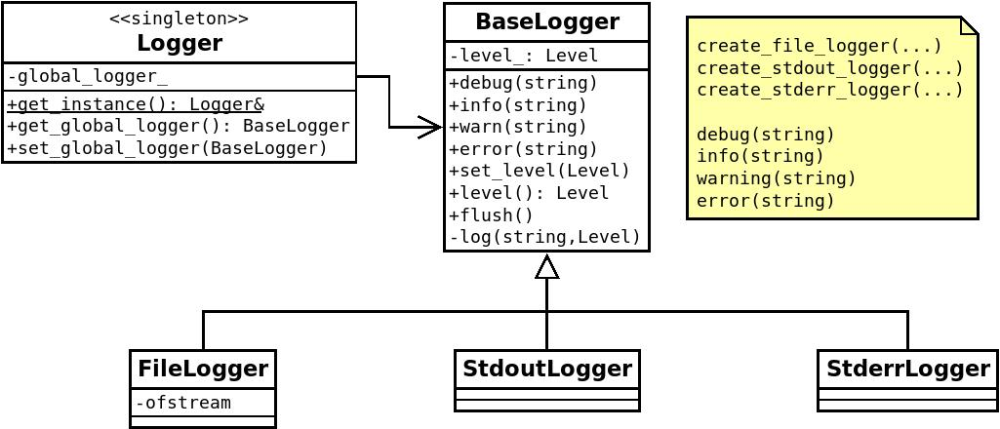

# hw2 - log

Нужно создать библиотеку с именем log. Функционал библиотеки должен позволять записывать лог программы в стандартные потоки ввода/вывода и в файл.
Лог должен обладать 4 уровнями: debug, info, warning, error.

Библиотека должна гарантировать базовую безопасность исключений и соответствовать диаграмме классов

